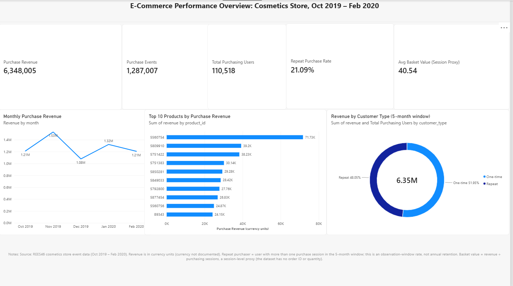
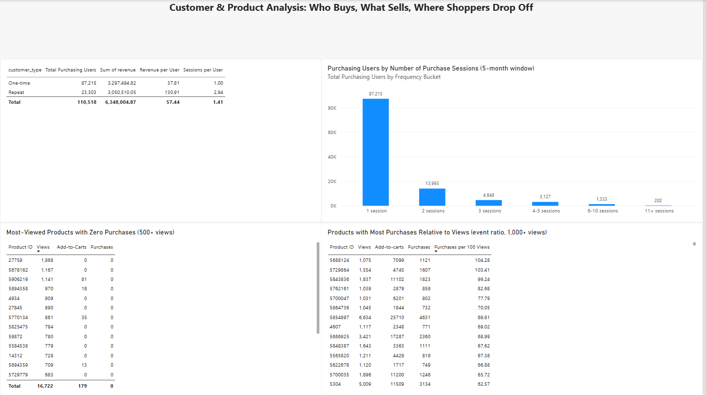
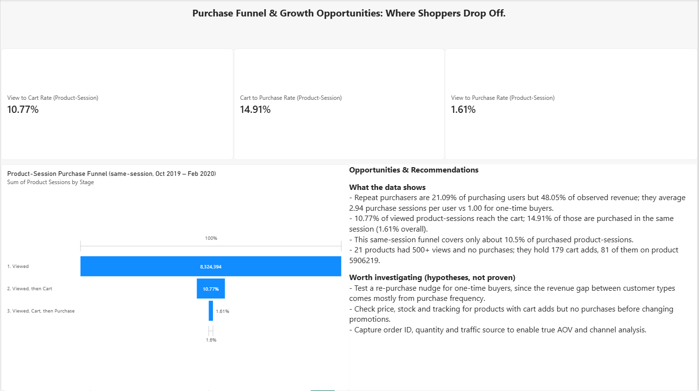

# Cosmetics E-Commerce Analytics: Revenue, Repeat Purchase & Funnel Drop-Off

**A SQL + Power BI case study on 20.7M shopper events from an online cosmetics store**



---

## Business Problem

You are a junior data analyst supporting an e-commerce team at an online cosmetics store. Management wants to understand:

- how revenue is performing over time,
- how many customers come back to buy again, and how much they are worth,
- which products attract attention but do not sell,
- where shoppers drop off between viewing a product, adding it to the cart and buying it.

This is a portfolio project built on a public dataset. The business scenario is a simulated framing, and no real company data is used.

## Objective

Turn raw clickstream events into a small set of well-defined KPIs, validate them against the source data, and present them in an interactive dashboard with recommendations. Every metric in this project is defined explicitly, and every claim is labelled as either an **observed fact** or a **hypothesis to test**.

## Dataset

| Item | Detail |
|---|---|
| Source | REES46 "eCommerce Events History in Cosmetics Shop" (Kaggle, `mkechinov`) |
| Period | 2019-10-01 to 2020-02-29 (5 months) |
| Size | 20,692,840 events (about 2.4 GB across 5 monthly CSV files) |
| Users / sessions / products | 1,639,358 / 4,535,941 / 54,571 |
| Grain | One row per user–product event |
| Event types | `view`, `cart`, `remove_from_cart`, `purchase` |
| Columns | `event_time`, `event_type`, `product_id`, `category_id`, `category_code`, `brand`, `price`, `user_id`, `user_session` |

The raw data is **not included** in this repository. Download it from Kaggle and check the licence terms on the dataset page.

**Important limitations of the dataset**

- No `order_id` and no quantity column, so **true order counts and true Average Order Value (AOV) cannot be calculated**.
- No traffic source or marketing channel, so channel performance and attribution cannot be analysed.
- Currency is not documented, so revenue is reported in "currency units".
- About 98.3% of events have no category and about 42.3% have no brand, so category and brand are not used as the main story.

## Tools

**SQL (DuckDB)** | **Power BI** | **DAX**

## KPIs and Definitions

| KPI | Definition | Value |
|---|---|---|
| Purchase Revenue | Sum of `price` on purchase events | 6,348,005 currency units |
| Purchase Events | Count of purchase events (each is one purchased item; there is no quantity field) | 1,287,007 |
| Purchasing Users | Distinct `user_id` with at least one purchase | 110,518 |
| Repeat-Purchase Rate | Users with more than one purchase session ÷ purchasing users, within the 5-month window | 21.09% (23,303 users) |
| Avg Basket Value (Session Proxy) | Purchase revenue ÷ purchasing sessions. This is a **session-level proxy**, not AOV | 40.54 |
| Revenue per User | Revenue ÷ distinct purchasing users, by customer type | 37.81 (one-time), 130.91 (repeat) |
| Purchase Sessions per User | Distinct purchase sessions ÷ purchasing users | 1.00 (one-time), 2.94 (repeat) |
| View → Cart rate | Product-sessions that viewed, then carted ÷ product-sessions that viewed | 10.77% |
| Cart → Purchase rate | Product-sessions that viewed, carted, then purchased ÷ product-sessions that viewed, then carted | 14.91% |
| View → Purchase rate | Product-sessions that viewed, carted, then purchased ÷ product-sessions that viewed | 1.61% |

> **Note:** Funnel rates are **product-session rates** (a product being viewed, carted and bought in the same session). They are not customer conversion rates. The repeat-purchase rate is an **observation-window metric**, not annual retention.

## Analysis

| Question | SQL file |
|---|---|
| How does revenue move month to month? | `monthly_kpis.sql` |
| Which products generate the most revenue? | `product_analysis.sql` |
| How many users buy once, twice, three times, and so on? | `customer_frequency.sql` |
| Is revenue dependent on a small group of very frequent buyers? | `heavy_users.sql` |
| Where do shoppers drop off between view, cart and purchase? | `funnel_analysis.sql` |
| How much of all purchasing does the funnel actually cover? | `purchased_product_sessions.sql` |
| What events surround purchases that fall outside the funnel? | `purchase_paths.sql` |
| Which well-viewed products never sold? | `zero_purchase_products.sql` |
| Which products have the most purchases relative to views? | `high_conversion_products.sql` |
| Build the tables used by Power BI | `build_database.sql` |

SQL techniques used: conditional aggregation (`SUM(CASE WHEN ...)`), CTEs, `MIN(CASE WHEN ...)` to capture the first view, cart and purchase time per product-session, a window function (`SUM(SUM(...)) OVER ()`) for revenue share, `NULLIF` for safe division, and `DATE_TRUNC` for monthly grouping.

Monthly purchase revenue (currency units):

| Month | Revenue |
|---|---|
| Oct 2019 | 1,211,538.43 |
| Nov 2019 | 1,531,016.90 |
| Dec 2019 | 1,077,624.85 |
| Jan 2020 | 1,321,535.48 |
| Feb 2020 | 1,206,289.21 |

## Dashboard

Built in Power BI from five aggregated tables produced by the SQL scripts (`monthly_kpis`, `product_performance`, `customer_segments`, `funnel_analysis`, `data_quality`). Every KPI on the dashboard was cross-checked against a DuckDB query.

**Page 1: Executive Overview**
Five KPI cards (revenue, purchase events, purchasing users, repeat-purchase rate, basket value proxy), monthly revenue trend, top 10 products by revenue, and revenue split by one-time vs repeat purchasers.


**Page 2: Customer & Product Analysis**
Customer type comparison, distribution of users by number of purchase sessions, a list of well-viewed products with zero purchases, and products with the most purchases relative to views.



**Page 3: Funnel & Opportunities**
Product-session funnel (viewed → cart → purchase), three funnel rate cards, and a panel that separates what the data shows from hypotheses worth testing.



### DAX measures (selected)

```
Total Purchasing Users = DISTINCTCOUNT(customer_segments[user_id])

Repeat Purchasers = CALCULATE(DISTINCTCOUNT(customer_segments[user_id]), customer_segments[customer_type] <> "One-time")

Repeat Purchase Rate = DIVIDE([Repeat Purchasers], [Total Purchasing Users])

Revenue per User = DIVIDE(SUM(customer_segments[revenue]), DISTINCTCOUNT(customer_segments[user_id]))

Sessions per User = DIVIDE(SUM(customer_segments[purchase_sessions]), DISTINCTCOUNT(customer_segments[user_id]))

Avg Basket Value (Session Proxy) = DIVIDE(SUM(monthly_kpis[revenue]), SUM(monthly_kpis[purchasing_sessions]))

Cart to Purchase Rate (Product-Session) = DIVIDE(SUM(funnel_analysis[viewed_cart_purchase]), SUM(funnel_analysis[viewed_then_cart]))
```

Also built: `View to Cart Rate` and `View to Purchase Rate` measures, a `Frequency Bucket` calculated column (with a `Bucket Order` sort column), and a `Funnel Stages` calculated table that reshapes the one-row funnel table for charting.

**Common calculation mistake avoided:** distinct counts (users, sessions) cannot be added across months, and averages cannot be summed. The users card uses `DISTINCTCOUNT` over one-row-per-user data, and basket value is a ratio of sums, not a sum or average of monthly averages.

## Key Insights

### 1. A small group of repeat purchasers generates almost half of revenue

- **Observation:** Repeat purchasers are 21.09% of purchasing users but 48.05% of observed revenue.
- **Evidence:** 23,303 repeat users generated 3,050,510.05; 87,215 one-time users generated 3,297,494.82. Observed revenue per user is 130.91 vs 37.81.
- **Interpretation:** Revenue is concentrated in returning buyers. This is descriptive. Repeat buyers had more opportunities to spend by definition, so the data does not show that repeat customers are inherently "more valuable".
- **Recommendation:** Treat retention as a lever worth testing (see recommendations).

### 2. The value gap is driven by purchase frequency, not larger baskets

- **Observation:** Repeat purchasers make 2.94 purchase sessions per user vs 1.00 for one-time buyers.
- **Evidence:** Revenue per purchase session is roughly 44.5 for repeat users (130.91 ÷ 2.94, derived) vs 37.81 for one-time users, about 18% higher.
- **Interpretation:** Most of the roughly 3.5x revenue-per-user gap comes from coming back more often.
- **Hypothesis (not proven):** Getting one-time buyers to purchase a second time may matter more than increasing basket size.

### 3. Most buyers purchase once, and the heaviest buyers are not a dependency risk

- **Observation:** 78.9% of purchasing users bought in only one session. Among repeat purchasers, 13,993 (about 60%) bought in exactly two sessions.
- **Evidence:** Users with 6 or more purchase sessions number 1,535 (about 1.4% of purchasers) and generate 9.4% of revenue. The other 108,983 users generate 90.6%.
- **Interpretation:** Revenue is moderately concentrated but not dependent on a handful of accounts.
- **Caveat:** Users whose first purchase came late in the window had less time to return, so the one-time share is probably overstated compared with a longer window.

### 4. The same-session funnel loses most shoppers at the view → cart step, and covers only about a tenth of purchases

- **Observation:** Of 8,324,394 product-sessions with a view, 896,530 (10.77%) reached the cart, and 133,713 (1.61% of views) went on to purchase in the same session. 14.91% of carted product-sessions purchased.
- **Evidence:** There are 1,276,291 purchased product-sessions in total, and only 133,713 (about 10.5%) fit the view → cart → purchase chain in the same session. About 81% (1,035,145) of purchased product-sessions have no view of that product in the same session, and 46.4% have neither a view nor a cart event. The table below is a diagnostic of which events occurred in the same session (not chronological).
- **Interpretation:** This funnel describes "browse and buy within one session", which is a minority path. It does not measure overall conversion. Of the 185,194 purchased product-sessions that contain both a view and a cart event, 133,713 (72.2%) meet the funnel's ordering rule; the rest do not (for example, the first cart event comes before the first view).
- **Hypotheses (unproven):** Shoppers may add to the cart in one session and buy in a later one, add items directly from listing or recommendation pages without a product-page view, reorder items they already know, or some events may not be tracked. This dataset cannot distinguish between these.

| Events in the same session as the purchase | Purchased product-sessions | Share |
|---|---|---|
| Neither view nor cart | 592,718 | 46.4% |
| Cart, no view | 442,427 | 34.7% |
| View and cart | 185,194 | 14.5% |
| View, no cart | 55,952 | 4.4% |

### 5. A short list of well-viewed products with carts but no purchases is worth investigating

- **Observation:** 21 products had 500 or more views and zero recorded purchases, with 16,722 views and 179 cart events between them.
- **Evidence:** Product 5906219 had 1,141 views and 81 cart events with no purchases; product 5770134 had 861 views and 35 carts; several other products had hundreds of views and no carts.
- **Interpretation:** This is a small, targeted list (a tiny fraction of the 20.7M events), useful as a diagnostic, not a large revenue leak.
- **Hypotheses (unproven):** Possible causes include price, stock availability, checkout friction, browse-only pages or tracking gaps. The data cannot tell them apart.

## Recommendations

These are evidence-based suggestions to **test or investigate**, not proven fixes.

1. **Test a second-purchase intervention for one-time buyers** (for example, a reorder reminder or follow-up offer), run as an A/B test so the effect can be measured. Supported by insights 1 to 3.
2. **Investigate products with cart activity but no purchases** (stock, price, checkout behaviour, tracking) before changing promotions. Supported by insight 5.
3. **Capture order ID, quantity and traffic source** so that true AOV, order-level analysis and channel attribution become possible.
4. **Measure the funnel across sessions**, so that carts created in one session and purchased in another are counted. Supported by insight 4.

## Data Quality

Checks run on the full 20,692,840-event dataset (from the `data_quality` table):

| Check | Result |
|---|---|
| Total events | 20,692,840 |
| Date range | 2019-10-01 00:00 to 2020-02-29 23:59 |
| Unique users / sessions / products | 1,639,358 / 4,535,941 / 54,571 |
| Products viewed / carted / purchased | 53,854 / 46,157 / 40,777 |
| Events missing `category_code` | 20,339,246 (about 98.3%) |
| Events missing `brand` | 8,757,117 (about 42.3%) |

Additional validation checks:

| Check | Result |
|---|---|
| Null `user_id`, `user_session`, `product_id`, `price` | **TODO: fill in from validation query 1** |
| Zero or negative prices (all events / purchases only) | **TODO: fill in from validation query 1** |
| Event type values | **TODO: fill in from validation query 2** |
| Exact duplicate events | **TODO: fill in from validation query 3** |

**Cleaning decisions and their effect**

- **No rows were deleted or modified.** All KPIs are computed on the full event set, so figures can be reproduced directly from the source files.
- **Missing category and brand were not imputed.** With about 98.3% of categories missing, any category analysis would mostly describe the missing data, so category and brand are not used as a primary story.
- **The funnel is chronological.** A product-session counts as "viewed then carted" only if its first cart event is at or after its first view, and as "purchased" only if its first purchase is at or after its first cart.
- **Dashboard KPIs were cross-checked against DuckDB** (revenue, purchase events, purchasing users, basket value, repeat rate, frequency buckets, funnel rates, product lists).

## Limitations

- **No order ID or quantity:** order counts and true AOV cannot be calculated. "Basket value" is a session-level proxy, and "purchase events" are counted as units.
- **No marketing channel data:** performance by channel and marketing attribution cannot be assessed.
- **Currency is undocumented:** revenue is in currency units.
- **Category and brand are largely missing:** they are not used for analysis.
- **Repeat-purchase rate is a 5-month observation-window metric** and is affected by when a user first bought. It is not annual retention or customer lifetime value.
- **The funnel is same-session and product-level** and covers about 10.5% of purchased product-sessions, so it is not a total conversion rate.
- **Event-based product ratios are not conversion rates:** some products show more purchases than views (ratios above 100%), and carts exceed views for all of the top 10 products by ratio. This suggests purchases and cart additions happen through routes not captured by view events.
- **No cost or margin data:** profitability cannot be assessed.
- **One store, five months:** results may not generalise, and Nov–Feb includes seasonal effects the data cannot separate.

## Future Improvements

Only where the data supports them:

- **Cohort retention analysis** by first-purchase month, which would correct for users who joined late in the window.
- **RFM segmentation** (recency, frequency, monetary value) using the existing user-level data.
- **Cross-session funnel analysis** to capture carts purchased in later sessions.
- **Experimentation design** for a second-purchase campaign (A/B test with a defined success metric).
- **Marketing attribution and CLV**, if traffic source data and a longer time window become available.

## Repository Structure

```
├── README.md
├── sql/                     # SQL scripts listed under "Analysis"
├── output/                  # Aggregated CSV tables loaded into Power BI
├── dashboard/
│   ├── cosmetics_ecommerce_dashboard.pbix
│   └── screenshots/
└── data/                    # Raw dataset (not included; download from Kaggle)
```

## How to Reproduce

1. Download the dataset from Kaggle and place the monthly CSV files in `data/`.
2. Edit the file path at the top of each SQL script if needed, then run `build_database.sql` and `funnel_analysis.sql` in DuckDB.
3. Export the five tables to `output/` as CSV.
4. Open the `.pbix` file in Power BI Desktop and refresh the data source path.

## Data Source and Attribution

Dataset: REES46 eCommerce Events History in Cosmetics Shop, published on Kaggle by Michael Kechinov. Please refer to the dataset page for licence terms and attribution requirements.
